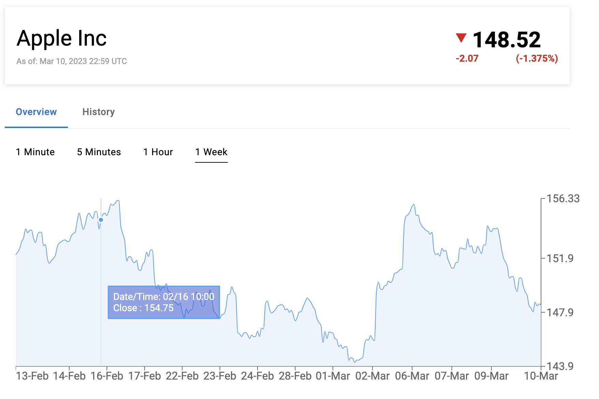

# Stock App

This app shows information about Apple stock

## Live Demo

https://stock-app-lior.netlify.app/

## Screenshot

## Installation and Usage

1. Clone the repository to your local machine using the command
   `git clone https://github.com/liordesta/stock-app.git`.
2. Navigate to the project directory using `cd stock-app`.
3. Install any necessary dependencies using `npm install or yarn install`.
4. Start the development server using `npm start or yarn start`.

## Technologies

List of technologies/tools used in the project:

- ReactJS
- React-Query
- Material-UI
- Recharts
- WebSocket
